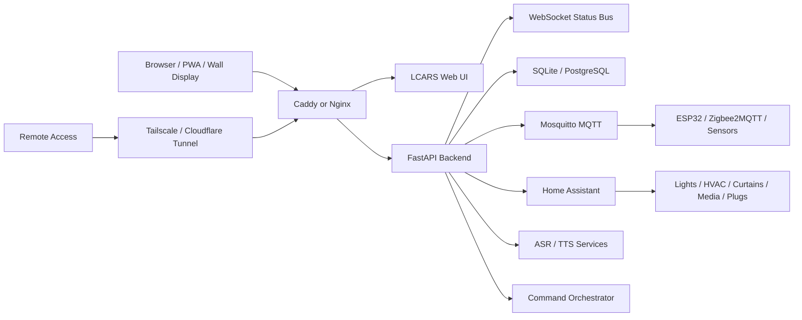
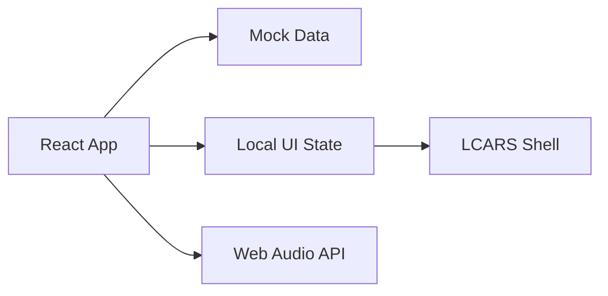
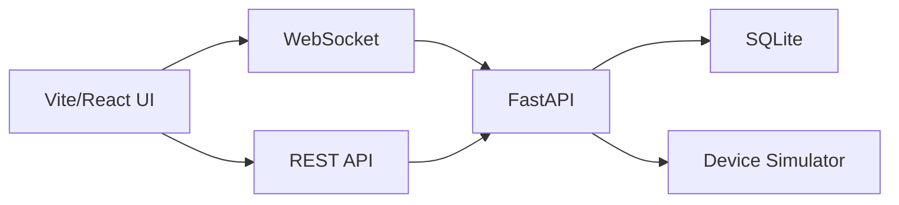

# Architecture

The long-term architecture should be local-first with optional cloud assistance.

## Recommended Shape

## Why Local-First

Smart-home control should continue working when external cloud services are down. Local-first also reduces latency, protects privacy, and avoids exposing home devices directly to the public internet.

Cloud can still help with:

- Remote access.
- Backups.
- Notifications.
- Optional hosted AI APIs.
- Domain and TLS management.

## V0 Architecture

V0 should not include a backend.

V0 state should be shaped so V1 can replace mock data with WebSocket/API data later.

## V1 Architecture

V1 introduces a backend but keeps all devices simulated.

## V2 Architecture

V2 connects real automation.

- Add Mosquitto MQTT.
- Add Home Assistant proxy integration.
- Add sensor event ingestion.
- Keep all command execution auditable.

## V3 Architecture

V3 adds voice and AI command interpretation.

Recommended approach:

- Browser captures audio.
- Backend receives audio chunks.
- ASR returns text.
- Rule engine handles common commands first.
- Optional AI layer helps map ambiguous commands.
- Command planner outputs explicit device actions.
- User-visible log records intent, action, and result.

Do not allow an LLM to directly control devices without an explicit command planner and safety layer.

